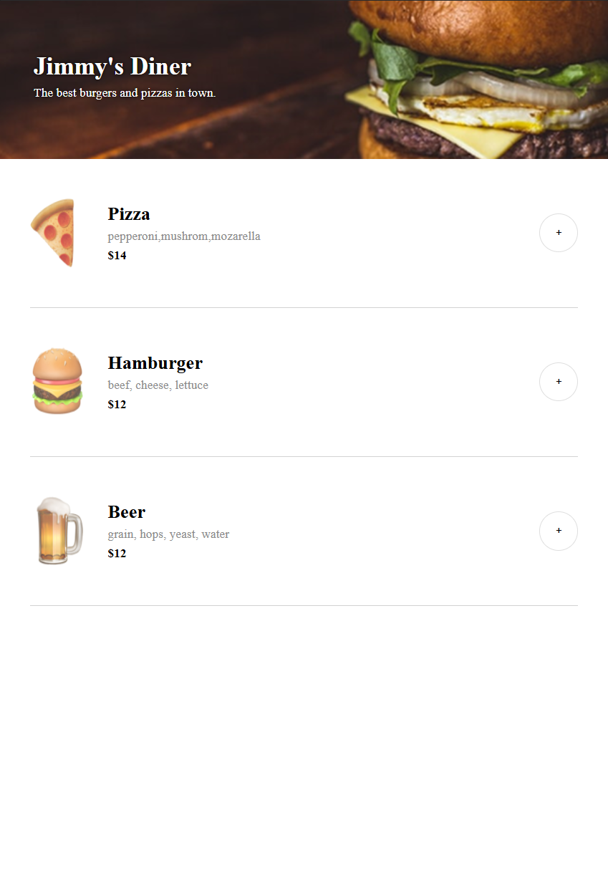

# 🍔 Restaurant Ordering App

A responsive restaurant ordering web application built with **HTML, CSS, and JavaScript**. Users can browse menu items, add food and drinks to their order, adjust quantities, remove items, and complete an order through a simple checkout flow.

This project was built to practice **JavaScript DOM manipulation, arrays, objects, event listeners, dynamic rendering, and user interactions**.

## 🚀 Live Demo

[View Live Demo](#)

## 📸 Preview



## ✨ Features

- 🍕 Dynamic restaurant menu
- ➕ Add menu items to an order
- ➖ Remove items from an order
- 🔢 Increase and decrease item quantities
- 🧾 Automatically calculate the order total
- 💳 Checkout/payment form
- ✅ Order confirmation
- 📱 Responsive layout
- ⚡ Dynamic UI updates without page reloads

## 🛠️ Built With

- **HTML5** — Page structure and semantic markup
- **CSS3** — Styling, layout, and responsive design
- **JavaScript (ES6+)** — Application logic and DOM manipulation
- **Vite** — Development environment and build tool

## 📚 What I Practiced

- JavaScript arrays and objects
- Functions and reusable code
- Event listeners
- DOM manipulation
- Template literals
- Conditional rendering
- Dynamic HTML generation
- Working with imported JavaScript data
- Managing application state
- Form handling
- Responsive web design
- Using Vite to develop and build a frontend application

## 📂 Project Structure

```text
restaurant-ordering-app/
│
├── images/
│   └── ...                 # Menu and project images
│
├── data.js                # Restaurant menu data
├── index.css              # Application styling
├── index.html             # Main HTML document
├── index.js               # Application logic
├── package.json            # Project configuration
├── vite.config.js          # Vite configuration
└── README.md
```

## 💻 Getting Started

### 1. Clone the repository

```bash
git clone https://github.com/Jabezgreenan/restaurant-ordering-app.git
```

### 2. Navigate into the project

```bash
cd restaurant-ordering-app
```

### 3. Install dependencies

```bash
npm install
```

### 4. Start the development server

```bash
npm run dev
```

Vite will provide a local development URL where you can view the application.

## 🎯 Project Goal

The goal of this project was to build a realistic restaurant ordering interface while strengthening my understanding of JavaScript and frontend development.

The menu and order information are dynamically generated and updated using JavaScript rather than being hard-coded into the HTML.

## 🔮 Future Improvements

- Add persistent cart data using `localStorage`
- Add menu categories and filtering
- Add item customization
- Add order history
- Add a backend API
- Add database integration
- Add real payment processing
- Add user authentication
- Improve accessibility
- Add automated testing

## 👨‍💻 Author

**Jabez Greenan**

Self-taught web developer focused on building modern, responsive web applications.

- GitHub: https://github.com/Jabezgreenan
- LinkedIn: https://www.linkedin.com/in/jabez-greenan-60b434271/

## 📄 License

This project is available for educational and portfolio purposes.
